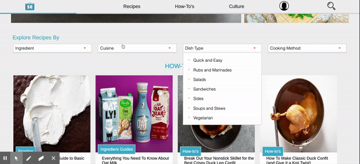

# Mean Eats
[Live Site](https://meaneats.herokuapp.com/)
# Description 
Mean Eats is a pixel-perfect tribute to the Serious Eats website with a more involved user authentication process. Users can browse and comment on posts, link posts by email or facebook, and navigate the site by tags or by search. The application is built with rails on the backend and react / redux on the frontend. All media is hosted with AWS S3. 
# Technologies 
- Ruby on Rails
- React
- Redux
- BCrypt
- JQuery
- PostgreSQL
- S3
- CSS 
- Heroku
# Some Features
## Tag System

Navigation on the meanEats website is achieved almost entirely by tags. 

---

You can navigate via tags in the PostShow header shown below, where you can see how the tags are organized hierarchically.

---

Or by each PostIndexItem

---

The tags are arranged in a tree starting at the model level. Scope creates a class method that finds the root of the tag tree. Because a given tag is a parent to and child of another tag, the class has belongs_to and has_many associations on itself.

```
class Tag < ApplicationRecord 
  scope: roots, -> { where(parent_id): nil }
  belongs_to :superior,
        optional: true,
        class_name: :Tag,
        foreign_key: :parent_id

  has_many :subs,
        class_name: :Tag,
        foreign_key: :parent_id
```

In the tags controller, the index action calls on the data method which builds out the tree recursively and is stored in @tags. Instance variable @tagIndex is a straight json list of each tag with its corresponding id. Both are sent back to the browser with every fetchTags call.

```
class Api::TagsController < ApplicationController 
    def tree_data 
        output = []
        Tag.roots.each do |tag|
            output << data(tag)
        end
        output.to_json
    end

    def data(tag)
        subs = []
        unless tag.subs.blank?
            tag.subs.each do |sub|
                subs << data(sub)
            end
        end
        {tag_name: tag.tag, subs: subs}
    end
    
    def index
        @tags = Tag.find_by(tag: "Root")
        @tags = data(@tags)
        @tagIndex = Tag.all.select(:id, :tag)
        render '/api/tags/index'
    end
```

Why organize our tags into a tree? 

1. Because a tree is easier to navigate and search through than a random list of tags and keywords

2. It makes parts of the meanEats UI easier to implement like nested dropdowns

--- 

---
Because of the tag tree, rendering the dropdowns above only takes 16 lines of code with a recursive level-order tree traversal function. 
```
const traverse = (tag, i) => {  
    if (tag.subs.length) {
        return (
            <ul className={`dropdown${i++}`}>
                {tag.subs.map(sub => (
                    <li className="sub-dropdown-element">
                        {sub.tag_name}
                        {traverse(sub, i)}
                    </li>
                ))}
            </ul>
        )
    } else {
        return null;
    }
}
