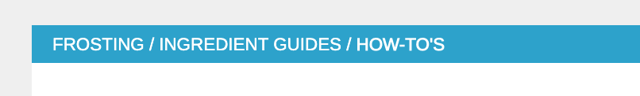
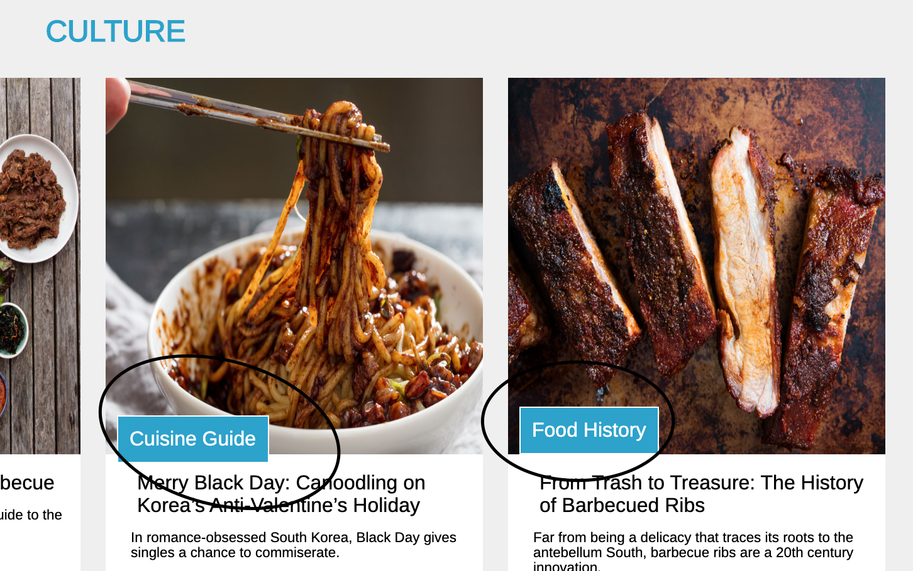

# Mean Eats
[Live Site](https://meaneats.herokuapp.com/)
# Description 
Mean Eats is a pixel-perfect tribute to the Serious Eats website with a more involved user authentication process. Users can browse and comment on posts, link posts by email or facebook, and navigate the site by tags or by search. The application is built with rails on the backend and react / redux on the frontend. All media is hosted with AWS S3. 
# Technologies 
- Ruby on Rails
- React
- Redux
- BCrypt
- JQuery
- PostgreSQL
- S3
- CSS 
- Heroku
# Features
## Tag System

Navigation on the meanEats website is achieved almost entirely by tags. 

---
You can navigate via tags in the PostShow header shown below

---
Or by each PostIndexItem

---
